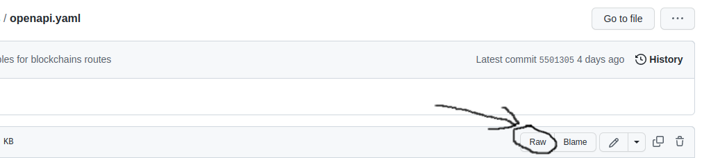

# Data-api-doc

This is a repository containing [OpenAPI](https://spec.openapis.org/oas/v3.1.0) documentation for the `Staking rewards API` project.

## Service overview

It is assumed that this documentation will be hosted using [Redocly](https://redocly.com/docs/redoc/deployment/intro/)

## Where can I find documentation at the moment
1. ([Redoc](https://redocly.com/redoc-vs-reference/) version): Documentation is generated by commit and collected [here](https://api.data.p2p.org/stakingapi/doc/).
2. ([Redocly](https://redocly.com/redoc-vs-reference/) version): Documentation is generated by timing and collected [here](https://api-data-p2p.redoc.ly/). 
   Documentation is managed through an [account](https://app.redocly.com/login). Request an invite if necessary.

## Installation

If you have Docker installed, pull the image with the following command:

```
$ docker pull redocly/redoc
```

## Usage
Then run the image with the following command.
Use the `SPEC_URL=` path to the OpenAPI documentation.

### One of the options to use (Serve OpenAPI documentation on GitHub)
- Set the repository to `public` mode where the OpenAPI documentation is stored
- Use the link that serve the raw documentation view

```
$ docker run -p 8080:80 -e SPEC_URL=https://raw.githubusercontent.com/repo/test-open-api-doc/master/openapi.yaml redocly/redoc
```